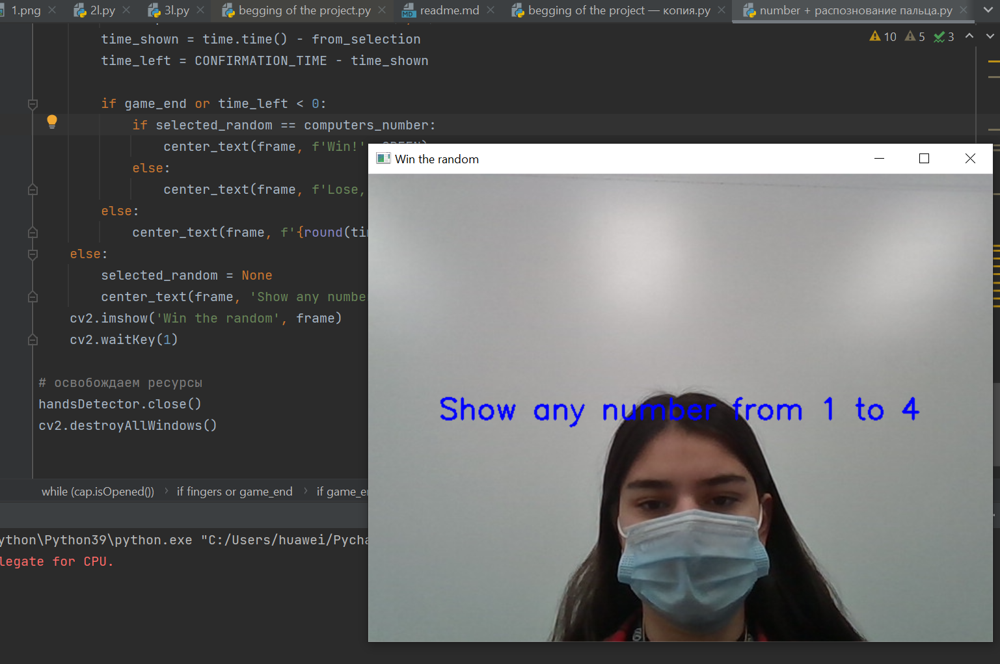
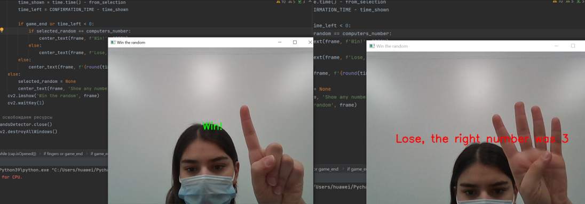

# Журнал проекта 

А тут описаны мои шаги по проекту. С Богом!


## Начнем с камеры!
вот такой вот кодик получился для запуска камеры и открывающегося окошка, чтобы игрок показывал свои пальцы 
```
import cv2  
import numpy as np  
# Обычно камера имеет номер 0  
cap = cv2.VideoCapture(0)  
while(cap.isOpened()):  
   # Читаем очередной кадр  
  ret, frame = cap.read()  
   # Задерживаем на 1 миллисекунду, ждем нажатия q  
  if cv2.waitKey(1) & 0xFF == ord('q') or not ret:  
        break  
  # Переводим изображение в монохром  
 # И отображаем кадры в одном и том же окне  cv2.imshow('Победи рандом', frame)  
   cv2.waitKey(1)  
cv2.destroyAllWindows()
```
как это сейчас работает смотрим на фотографии cap.png 


## Дальше генерируем число 
```
k=(random.randint(1, 4))
```
вы спросите почему 4?
Потому что:
### Сложность номер 1
я поняла что мне придется показывать от 1-4 пальцев, потому что прописать индекс большого пальца невозможно. И при поднятом состоянии и при прижатом там все одинаково. 

## Тут я читаю индексы ручки 
```
if results.multi_hand_landmarks is not None:  
   # нас интересует только подушечка указательного пальца (индекс 8)  
 # нужно умножить координаты а размеры картинки  y_6 = int(results.multi_hand_landmarks[0].landmark[6].y *  
             flippedRGB.shape[0])  
   y_8 = int(results.multi_hand_landmarks[0].landmark[8].y *  
             flippedRGB.shape[0])  
   y_10 = int(results.multi_hand_landmarks[0].landmark[10].y *  
             flippedRGB.shape[0])  
   y_12 = int(results.multi_hand_landmarks[0].landmark[12].y *  
             flippedRGB.shape[0])  
   y_14 = int(results.multi_hand_landmarks[0].landmark[14].y *  
              flippedRGB.shape[0])  
   y_16 = int(results.multi_hand_landmarks[0].landmark[16].y *  
              flippedRGB.shape[0])  
   y_18 = int(results.multi_hand_landmarks[0].landmark[19].y *  
              flippedRGB.shape[0])  
   y_20 = int(results.multi_hand_landmarks[0].landmark[20].y *  
              flippedRGB.shape[0]
```
Теперь я немного поменяю beggining и закомичю новую версию, потому что в старой я просто не учла хэнд детектор. 


###  Тут я решила проверить правильность моей программы:
```
if y_6<y_8 and y_10<y_12 and y_14<y_16 and y_18<y_20:  
   fingers=0  
if y_6>y_8 and y_10<y_12 and y_14<y_16 and y_18<y_20:  
   fingers=1  
if y_6>y_8 and y_10>y_12 and y_14<y_16 and y_18<y_20:  
   fingers=2  
if y_6>y_8 and y_10>y_12 and y_14>y_16 and y_18<y_20:  
   fingers=3  
if y_6>y_8 and y_10>y_12 and y_14>y_16 and y_18>y_20:  
   fingers=4
```
fingers - переменная, означающая количество пальцев, показанное человеком. 
Дальше я сравниваю fingers с сгенерированным числом:
```
if fingers==randoms:  
   print("You are the winner!")  
else:  
   print("Loser!")
 ```


на данном этапе все прекрасно работает. 
Как именно? См. фотку снизу (version1.png)


## Работа с оформлением
Эта часть заняла очень много времени. Зато теперь интерфейс игры адекватный. Тут есть текст с цветами:
```
def center_text(image, text, color):  
    font = cv2.FONT_HERSHEY_SIMPLEX  
  
    textsize = cv2.getTextSize(text, font, 1, 2)[0]  
    textX = round((image.shape[1] - textsize[0]) / 2)  
    textY = round((image.shape[0] + textsize[1]) / 2)  
    cv2.putText(image, text, (textX, textY), font, 1, color, 2)
 ```
 Также, в код добавлен таймер! Теперь в начале игры ведется отсчет
Как выглядит начало см. картинку result.png снизу



Как выглядит ход игры см. картинку result2.png



# Чек и сверка с планом 
Проверим все в соответствии с планом работы:
1.  Запускать камеру, где игрок может показывать свои руки
2.  Компьютер генерирует число от 1 до 4
3.  Вести обратный отсчет в начале игры
4.  Распознается число, показанное игроком на камеру (количество показанных пальцев от 1 до 4)
5.  Игрок побеждает если угадал число, сгенерированное компьютером или нет

- камера реально подключается
- Число генерируется от 1-4
- Обратный отсчет реально ведется 
- Числа распознаются 
- Суть игры совпала

А это значит что мы все сделали!

### приятной игры в 
# WIN THE RANDOM!!! 


